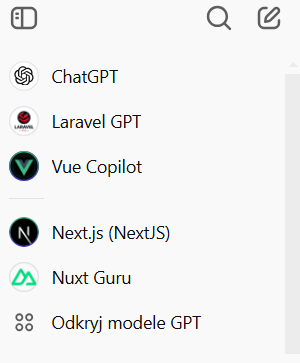
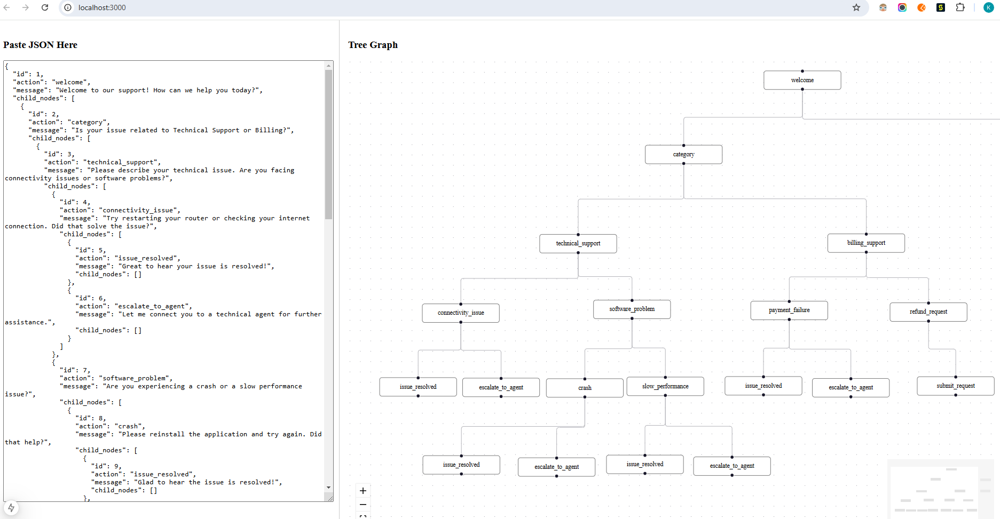
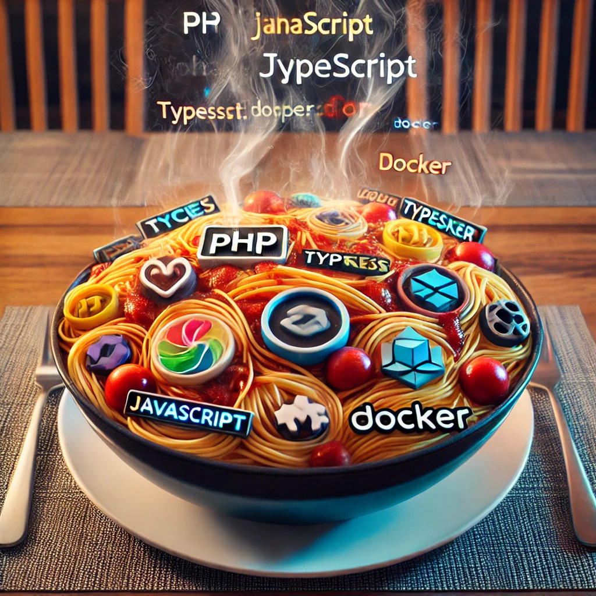
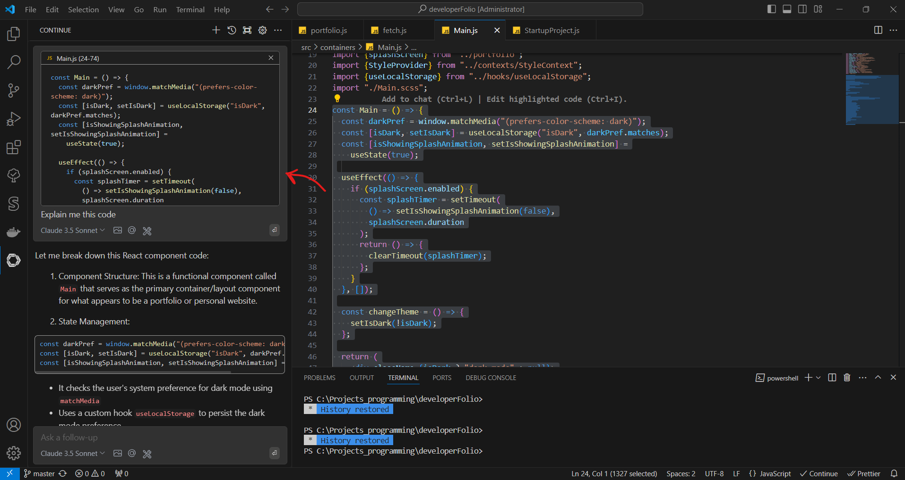
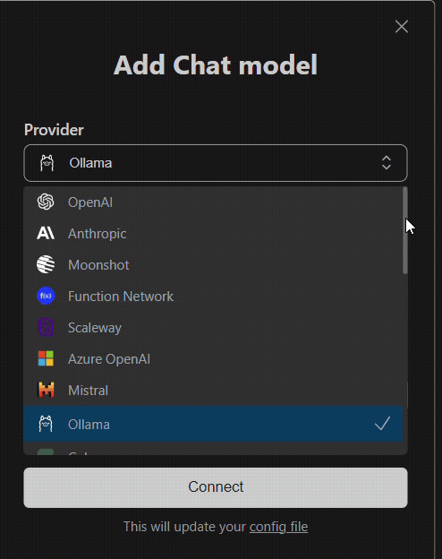

# Intro

In this post I will show you how I leverage Generative AI tools to help build software faster. Those are the tools I currently use, and those help me significantly. For a lot of you that patters are obvious but if you have not tried this approach, or tested it some time age when models were not yet there, I highly recommend giving it another shot.

<!-- truncate -->

## ChatGPT

Everyone is using it in daily tasks, the question is are you using it properly? I’m a hardcore user myself and it helped me a lot during my projects. I’m paying for a plus subscription, so about $25/mo, but it’s worth it in my opinion because you get access to latest models like o1 that totally outperforms the previous ones, plus you get access to models fine-tuned for certain frameworks and languages. If i’m not satisfied with the output, I’m often switching to a different ones and testing. I found most useful the following ones:

- ChatGPT o1 - for general help in things i’m not proficient like DevOps, deployment, or a major refactors of the code
- [Laravel GPT](https://chatgpt.com/g/g-XTOuIQ6Tz-laravel-gpt) - Since I develop my backends mostly in Laravel, it’s perfect for creating Models, Migrations, Policies and basic Controllers
- [Vue Copilot](https://chatgpt.com/g/g-V9flHctZB-vue-copilot) - For Vue.js frontend
- [Nuxt Guru](https://chatgpt.com/g/g-rKKxzoA8F-nuxt-guru) - For Nuxt.js meta framework built on top of vue (It’s like Next but for Vue.js)
- [Next.js (NextJS)](https://chatgpt.com/g/g-lAbjRB9qC-next-js-nextjs) - This since I’m also picking up some React and Next to broaden my skillset



The tasks that I give to chat can be split into 3 main parts

1. Prototyping - So if I’m starting a new project, I’m outlining to chat the concept of a product that I want to build. For example an interface of a web app that will be an enchanced chatbot with a fields to fill it that will guide the user. I will then specify the tools I want to use (Nuxt, Vuetify, Typescript or javascript, vite ect.). In the prompt i’m asking it How to create it? What this does is provides me with full setup instructions on how to set up something even without specified knowledge about the dependencies. Plus it provides me with basic layouts of the pages.

   For example, this is the prompt i used to make simple flow visualisation app:

   ```jsx
   Tell me how to create a simple app with next.js that will have a text area on the left to which user can paste a json object with a sequece, and on the right it there will appear a graphical representation in the form of the tree graph(in the way that on the top there is one component with 2 branches on botom and then to nodes). When hovered over the sequence node, the details will appear on tooltip.
   Here is example of json sequence that will be used, (also us it as example sequence on start:
   {
     "id": 1,
     "action": "welcome",
     "message": "Welcome to our support! How can we help you today?",
     "child_nodes": [
       {
         "id": 2,
         "action": "category",
         "message": "Is your issue related to Technical Support or Billing?",
         "child_nodes": [
           {
             "id": 3,
             "action": "technical_support",
             "message": "Please describe your technical issue. Are you facing connectivity issues or software problems?",
             "child_nodes": [
       {...}// The rest of JSON example
            ]} 
        ]}
    ]}
   ```

Now, there is a problem because the context window is limited. It will not give you all the pages and all the details for every component at once. For this, I usually ask the chat additional questions about expanding the certain components, providing specific details about the functionality. This allows me to generate the code for specific component having already the context of newly created app.

It this case it used some outdated react library for flow charts, so i simply asked him this:

```jsx
Use this library @xyflow/react
```

I’d say it’s a pretty decent job, given that I only changed few lines of code to make the graph container wider, and adjust inital spacing of the nodes:



2. Fixing bugs - I give to the AI are the tasks connected to solving problems and bugs within my code. Let’s say I encouner an error and I don’t understand right away why it has appeared. I’m providing in the first sentence the context of the app, and then I just copy the error and the part of the code that is causing the trouble and I will ask chat why this is happening and how can it be solved. Often times it requires more iterative approach because the first proposed solution is almost never the desired one. I keep testing the generated code and come back to chat with additional feedback. This creates the feedback loop in the conversation and It will land you the solution.
3. Refactors and making the code readable - I often catch myself writing a spaghetti code, so the code that is long and when you come back to it, it's not so easy to understand the logic behind it.



ChatGPT helps to split the code into more methods, classes and simplifies some parts of it. And for these tasks the o1 model works the best. You just put your code in the prompt and order the chat to split it into different classes or methods and simplify it. In most cases, after the split it works perfectly fine and no adjustments are needed.

## Continue

[Continue](https://www.continue.dev/) is an extension that you can install in your VS Code or your JetBrains IDE. It’s like GitHub Copilot but you are in charge of the models you use. It hes 2 main functions

1. Autocomple that will basically complete your code as you write or generate code based on your comment.
2. Chat functionality that can be aware of your codebase

The chat is perfect for adding new features to your existing code and asking the questions in the context of your files in the project because you can easily add to the prompt the context of a whole file using @ handle.

It is also great for rewrites and tweaking your code. You can just select lines you want to add to chat and hit Ctrl+L, and it will automaticly add it to the context.



Now this extension requires some setup. You need to register with your preffered AI API provider (Continue supports 20+ providers) put a couple of dollars there and get an API key. I use Claude for the chat, and for autocomplete I use recommended Codestral model from Mistral for autocomplete. It’s actually free to use as of Decemeber 2024 and it works pretty good. It's not perfect, but it often identifies the patters within your code, and speeds up writing.



Those tools help me develop things on 5x speed, and don’t waste time on repetitive tasks, searching for solutions on forums or reading the docs. Of course those actions are still necessary sometimes but I find myself doing it less, and only in the really hard cases.

I will probably experiment with other models for the extension and update this article
